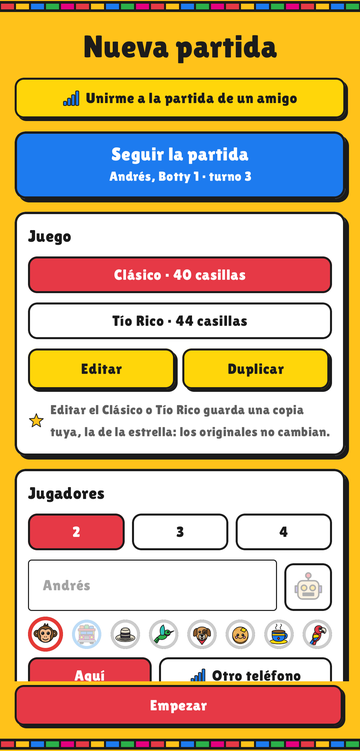
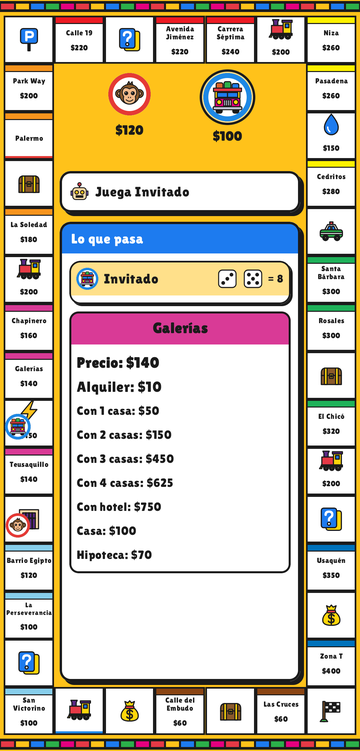
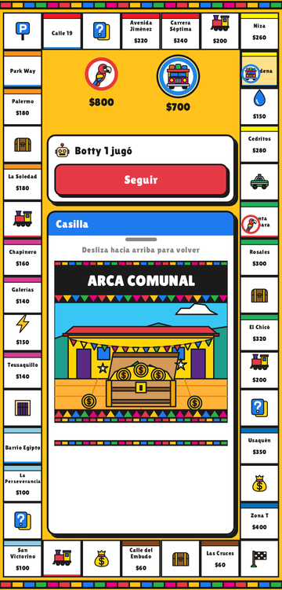
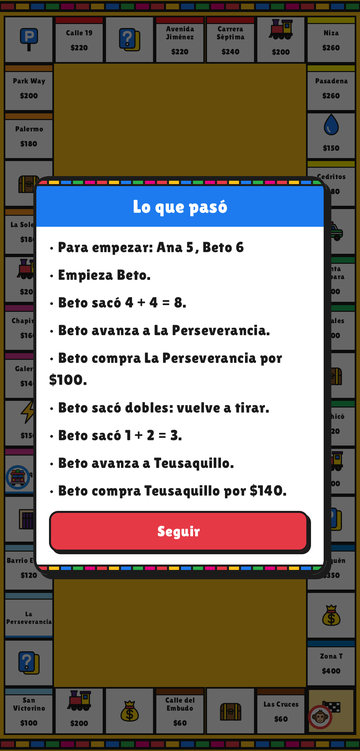
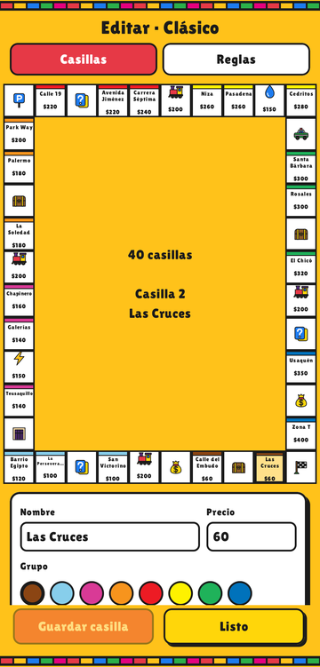
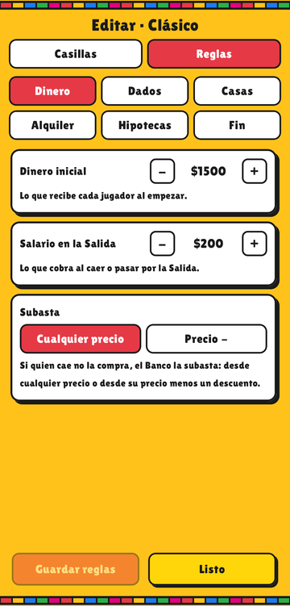

# Mono

Juego de propiedades para Android al estilo del **Tío Rico** y del **Monopoly**, hecho para jugar con amigos en un mismo teléfono o en dos teléfonos por la red Wi-Fi. Se compra, se construye, se hipoteca y se cobra alquiler hasta que solo queda uno; y casi todo se puede cambiar: los nombres y precios de las casillas, el tamaño del tablero y las reglas.

| | | |
|:-:|:-:|:-:|
|  |  |  |
| Nueva partida | La hoja de una propiedad | Una casilla de carta |
|  |  |  |
| Lo que pasó en el turno | Editar las casillas | Editar las reglas |

## Qué tiene

- **Dos tableros de fábrica:** el Clásico (40 casillas, con barrios y calles de Bogotá) y Tío Rico (44 casillas). Editarlos guarda una copia tuya; los originales no cambian.
- **De 2 a 4 jugadores** en el mismo teléfono, cada uno con su personaje. Cualquier puesto lo puede jugar la máquina («Botty»).
- **Partida en red:** un puesto puede ser «Otro teléfono»; el amigo, en la misma red Wi-Fi, entra con «Unirme a la partida de un amigo». Si la conexión se corta, el invitado vuelve a entrar y la partida sigue donde iba.
- **La partida se guarda sola** y se retoma con «Seguir la partida».
- **Editor:** cambiar el nombre, el precio, el grupo y los alquileres de cada casilla; añadir o quitar casillas; y 28 reglas configurables (abajo).
- **Arte propio** dibujado por código (`arte/`), sin imágenes de terceros.

## Cómo jugar

1. En **Nueva partida**, elige el tablero y cuántos juegan. Escribe los nombres y elige los personajes; el botón del robot deja ese puesto a la máquina y «Otro teléfono» lo deja para un amigo en red.
2. **Empezar.** Se tira para ver quién empieza.
3. En tu turno: **Tirar los dados**. Si caes en una propiedad libre, **Comprar** o **No comprar** (entonces el Banco la subasta). Si es de otro, se le paga el alquiler.
4. En tu lista de propiedades, cada una tiene sus botones: **Construir**, **Vender**, **Hipotecar** o **Levantar** la hipoteca.
5. Quien no puede pagar vende o hipoteca; si aun así no alcanza, quiebra. Gana el último que queda (o, si así se configura, el más rico en la segunda quiebra).

## Reglas configurables

Cada tablero lleva sus reglas; se cambian en **Editar → Reglas**. Donde el Tío Rico y el Monopoly difieren, es una opción.

| Pestaña | Reglas |
|---|---|
| Dinero | Dinero inicial · Salario en la Salida · Subasta (desde cualquier precio o desde su precio menos un descuento) |
| Dados | Los dobles dan otra tirada · Dobles seguidos que mandan a la Cárcel · Empate al empezar · Multa para salir de la Cárcel · Turnos máximos en la Cárcel |
| Casas | Casas antes del hotel · Construir parejo · Construir solo al caer · Precio de la casa y del hotel · El hotel devuelve sus casas · Vender edificios al Banco · Casas y hoteles del Banco |
| Alquiler | Grupo completo cobra ×2 · Hotel en todo el grupo cobra ×2 · La hipotecada cobra alquiler |
| Hipotecas | Valor de la hipoteca · Hipotecar con edificios · Interés o cargo fijo al levantarla · Redondeo de los porcentajes |
| Fin | Cómo termina (queda uno o segunda quiebra) · Interés de la quiebra · Escrituras al empezar |

Las reglas salen de los reglamentos impresos de los dos juegos: cada una está transcrita con su página en [`REGLAS.md`](REGLAS.md) (54 fichas, R-01 a R-54) y tiene su prueba en el motor.

## Compilar e instalar

Hace falta [Android Studio](https://developer.android.com/studio) (trae el JDK y el SDK de Android) y un teléfono con **Android 8.0 o más nuevo**.

**Desde Android Studio:** *File → Open* la carpeta del proyecto, conectar el teléfono por USB con la depuración USB activada y pulsar *Run*.

**Desde la terminal** (Linux; el JDK es el que trae Android Studio):

```bash
export JAVA_HOME=~/android-studio/jbr
./gradlew :engine:test :app:assembleDebug        # pruebas del motor y APK de depuración
adb install -r app/build/outputs/apk/debug/app-debug.apk
```

Gradle busca el SDK de Android en `local.properties` (Android Studio lo crea al abrir el proyecto) o en la variable `ANDROID_HOME`.

**Jugador del PC (opcional):** un programa de consola con el mismo motor que se une a una partida del teléfono o abre una sala para que el teléfono se una. Sirve sobre todo para probar el juego en red:

```bash
./gradlew :terminal:installDist
terminal/build/install/mono-pc/bin/mono-pc --sala --puerto 40000
```

Versiones: Kotlin 2.4.20, Android Gradle Plugin 9.4.1, Gradle 9.8.0 y Compose BOM 2026.09.00 (lista completa en [`gradle/libs.versions.toml`](gradle/libs.versions.toml)).

## Estructura

```
engine/      Motor de reglas en Kotlin puro (sin Android): tablero, dados, compras, subastas,
             construcción, hipotecas, cárcel, cartas, quiebra, la máquina y el enlace en red.
app/         La app de Android con Jetpack Compose: menú, partida, editor y juego en red.
terminal/    El jugador de consola del PC (mono-pc), con el mismo motor.
pc/          Script de Python para medir la conexión con el teléfono.
arte/        arte.py y arte/dibujos/: dibujan cada casilla, ícono y personaje y generan
             los SVG y los recursos de Android. La letra Lilita One y su licencia, en arte/letra/.
docs/        Capturas de este README.
REGLAS.md    Transcripción de los reglamentos, regla por regla.
PLAN_MONO.md Plan del proyecto y hoja de ruta por fases.
Agente_Mono/ y .claude/   Decisiones (DECISIONES.md) y las herramientas con las que se hizo el proyecto.
```

El motor es determinista: con la misma semilla, la misma partida. Se prueba solo con `./gradlew :engine:test`.

## Créditos

- Idea, diseño y pruebas en el teléfono: TheShimmyXD. Programado con la ayuda de Claude Code.
- Letra **Lilita One**, de Juan Montoreano, con la [SIL Open Font License 1.1](arte/letra/OFL_LilitaOne.txt).
- Monopoly y Tío Rico son marcas de sus dueños. Mono es un proyecto de aficionado, sin relación con ellos, y no incluye sus reglamentos, tableros ni imágenes.

## Licencia

[MIT](LICENSE): se puede usar, copiar y modificar libremente, conservando el aviso de la licencia. La letra Lilita One mantiene su propia licencia (OFL 1.1).
